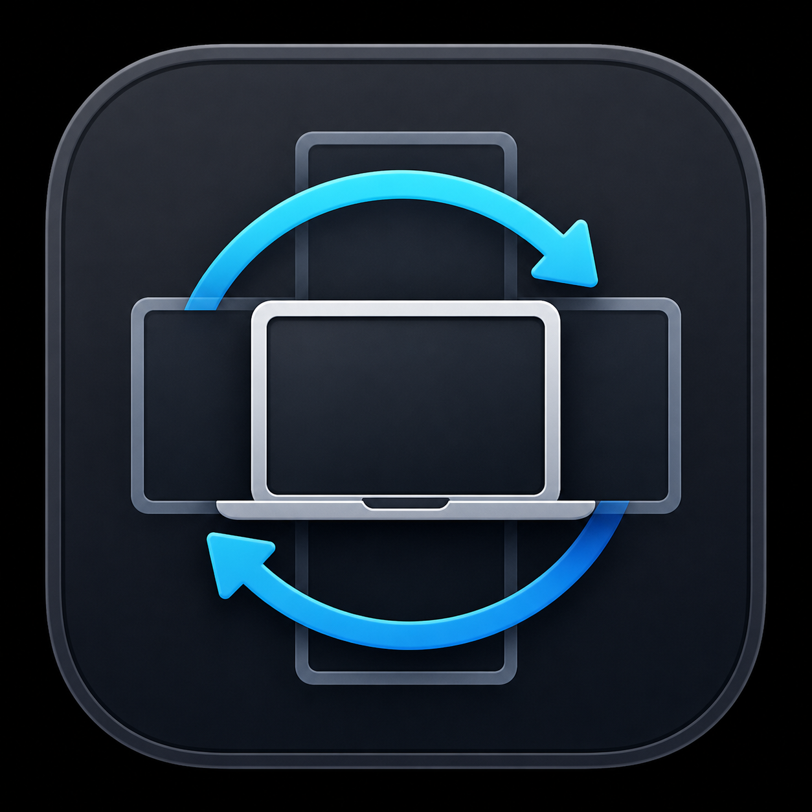

# Mac Screen Rotator

MacBook 내장 디스플레이를 0°, 90°, 180°, 270°로 회전시키는 macOS 메뉴 막대 앱이다.



## 다운로드 및 설치

[GitHub Releases](https://github.com/wongil12/mac-screen-rotator/releases/latest)에서 최신 `Mac-Screen-Rotator-vX.Y.Z.dmg`를 다운로드한다.

1. DMG를 연다.
2. `Mac Screen Rotator.app`을 `Applications`로 드래그한다.
3. 응용 프로그램 폴더에서 앱을 실행한다.
4. 메뉴 막대의 화면 회전 아이콘에서 각도를 선택한다.

지원 환경:

- macOS 26.0 이상
- Apple Silicon MacBook
- Intel Mac 미지원
- M5 MacBook Pro / macOS 26.2 검증

## PoC 안전 원칙

실제 회전 시험은 원래 각도를 기록하고 별도 복구 프로세스를 시작한 다음 수행한다. 기본적으로 15초 후 원래 방향으로 돌아온다.

## 실행

요구 사항:

- macOS 26 이상
- Xcode Command Line Tools
- `brew install displayplacer`

```bash
swift build
.build/debug/screen-rotator-poc inspect
.build/debug/screen-rotator-poc rotate-test 90
```

`rotate-test`는 0, 90, 180, 270 중 하나를 받는다. 현재 각도와 같은 값은 시험하지 않는다. 목표 각도를 3초간 유지한 뒤 원래 각도로 복구하며, 별도 프로세스가 15초 후 한 번 더 원복을 보장한다.

## 메뉴 막대 앱

```bash
swift run MacScreenRotator
```

주요 기능:

- 0°, 90°, 180°, 270° 선택
- `⌘⌥R` 전역 단축키로 다음 방향 회전
- 15초 확인 및 자동 원복
- 앱 비정상 종료에도 동작하는 독립 failsafe helper
- 잠자기 해제 후 마지막으로 확인한 방향 복원
- 디스플레이 구성 변경 감지
- 긴급 0° 복구
- 로그인 시 자동 실행

## 앱 번들 생성

```bash
scripts/build-app.sh
```

생성 결과는 `dist/Mac Screen Rotator.app`이다. 서명과 공증 절차는 [`docs/distribution.md`](docs/distribution.md)를 참고한다.

GitHub Releases 자동화는 [`docs/github-release.md`](docs/github-release.md)를 참고한다.
